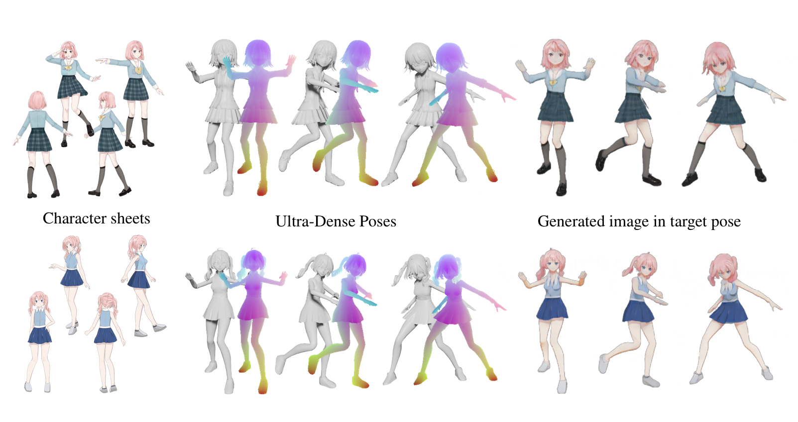

[English](https://github.com/megvii-research/CoNR/blob/main/README.md) | [中文](https://github.com/megvii-research/CoNR/blob/main/README_chinese.md)
# CoNR: 用于二次元手绘设定稿动画化的神经渲染器


## [HomePage](https://conr.ml) | Colab [English](https://colab.research.google.com/github/megvii-research/CoNR/blob/main/notebooks/conr.ipynb)/[中文](https://colab.research.google.com/github/megvii-research/CoNR/blob/main/notebooks/conr_chinese.ipynb) | [arXiv](https://arxiv.org/abs/2207.05378)



## Introduction

该项目为论文[Collaborative Neural Rendering using Anime Character Sheets](https://arxiv.org/abs/2207.05378)的官方复现，旨在从手绘人物设定稿生成生动的舞蹈动画。您可以在我们的[主页](https://conr.ml)中查看更多视频 demo。

贡献者: [@transpchan](https://github.com/transpchan/), [@P2Oileen](https://github.com/P2Oileen), [@hzwer](https://github.com/hzwer)

## 使用方法

#### 需求

* Nvidia GPU + CUDA + CUDNN
* Python 3.6

#### 安装

* 克隆该项目

```bash
git clone https://github.com/megvii-research/CoNR
```

* 安装依赖

请运行以下命令以安装CoNR所需的所有依赖。

```bash
cd CoNR
pip install -r requirements.txt
```

* 下载权重
运行以下代码，从 Google Drive 下载模型的权重。此外, 你也可以从 [百度云盘](https://pan.baidu.com/s/1U11iIk-DiJodgCveSzB6ig?pwd=RDxc) (password:RDxc)下载权重。

```
mkdir weights && cd weights
gdown https://drive.google.com/uc?id=1M1LEpx70tJ72AIV2TQKr6NE_7mJ7tLYx
gdown https://drive.google.com/uc?id=1YvZy3NHkJ6gC3pq_j8agcbEJymHCwJy0
gdown https://drive.google.com/uc?id=1AOWZxBvTo9nUf2_9Y7Xe27ZFQuPrnx9i
gdown https://drive.google.com/uc?id=19jM1-GcqgGoE1bjmQycQw_vqD9C5e-Jm
```

#### Prepare inputs
我们为两个不同的人物，准备了两个超密集姿势（Ultra-Dense Pose）序列，从以下代码中二选一运行，即可从 Google Drive 下载。您可以通过任意的3D模型和动作数据，生成更多的超密集姿势序列，参考我们的[论文](https://arxiv.org/abs/2207.05378)。暂不提供官方转换接口。
[百度云盘](https://pan.baidu.com/s/1hWvz4iQXnVTaTSb6vu1NBg?pwd=RDxc) (password:RDxc) 

```
# 短发女孩的超密集姿势
gdown https://drive.google.com/uc?id=11HMSaEkN__QiAZSnCuaM6GI143xo62KO
unzip short_hair.zip
mv short_hair/ poses/

# 双马尾女孩的超密集姿势
gdown https://drive.google.com/uc?id=1WNnGVuU0ZLyEn04HzRKzITXqib1wwM4Q
unzip double_ponytail.zip
mv double_ponytail/ poses/
```

我们提供两个人物手绘设定表的样例，从以下代码中二选一运行，即可从 Google Drive下载。您也可以自行绘制。
请注意：人物手绘设定表**必须从背景中分割开**，且必须为png格式。
[百度云盘](https://pan.baidu.com/s/1shpP90GOMeHke7MuT0-Txw?pwd=RDxc) (password:RDxc) 

```
# 短发女孩的手绘设定表
gdown https://drive.google.com/uc?id=1r-3hUlENSWj81ve2IUPkRKNB81o9WrwT
unzip short_hair_images.zip
mv short_hair_images/ character_sheet/

# 双马尾女孩的手绘设定表
gdown https://drive.google.com/uc?id=1XMrJf9Lk_dWgXyTJhbEK2LZIXL9G3MWc
unzip double_ponytail_images.zip
mv double_ponytail_images/ character_sheet/
```

#### 运行!
我们提供两种方案：使用web图形界面，或使用命令行代码运行。

* 使用web图形界面 (通过 [Streamlit](https://streamlit.io/) 实现)

运行以下代码：

```
streamlit run streamlit.py --server_port=8501
```

然后打开浏览器并访问 `localhost:8501`, 根据页面内的指示生成视频。

* 使用命令行代码

请注意替换`{}`内容，并更换为您放置相应内容的文件夹位置。

```
mkdir {结果保存路径}

python -m torch.distributed.launch \
--nproc_per_node=1 train.py --mode=test \
--world_size=1 --dataloaders=2 \
--test_input_poses_images={姿势路径} \
--test_input_person_images={人物设定表路径} \
--test_output_dir={结果保存路径} \
--test_checkpoint_dir={权重路径}

ffmpeg -r 30 -y -i {结果保存路径}/%d.png -r 30 -c:v libx264 output.mp4 -r 30
```

视频结果将生成在 `CoNR/output.mp4`。

## 引用CoNR
```bibtex
@article{lin2022conr,
  title={Collaborative Neural Rendering using Anime Character Sheets},
  author={Lin, Zuzeng and Huang, Ailin and Huang, Zhewei and Hu, Chen and Zhou, Shuchang},
  journal={arXiv preprint arXiv:2207.05378},
  year={2022}
}
```

